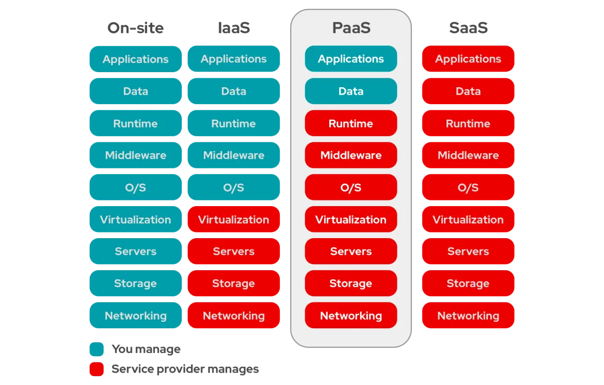

# 📝Cloud Computing

- [How Clod Computing Works?](#how-clod-computing-works)
- [Problems solved by the Cloud](#problems-solved-by-the-cloud)
- [The Five Characteristics of Cloud Computing](#the-five-characteristics-of-cloud-computing)
- [Types of Cloud Computing](#types-of-cloud-computing)
- [Types of Services on Cloud Computing](#types-of-services-on-cloud-computing)
- [Six Advantages of Cloud Computing](#six-advantages-of-cloud-computing)
- [Benefits of Cloud Computing](#benefits-of-cloud-computing)

### How Clod Computing Works?

- It works On Demand, the user/company pays only for what is using.
- Instant services and provisioning
- Scalability

## Problems solved by the Cloud

- Flexibility
- Cost-Effectiveness
- Scalability
- Elasticity
- High-availability and fault-tolerance
- Agility

## The Five Characteristics of Cloud Computing

- **On-demand self service**: Users can provision resources and use them without human interaction from the service providers. Everything is provisioned automatically.

- **Broad Network Access**: The resources are available over the network and can be accessible by others platforms inside the cloud or between customer services.

- **Multi-tenancy and Resource Pooling**: Multiple customers can share the same physical infrastructure or application with security and data privacy. In cloud commonly the same hardware is used to Multiple customers, and the data keeps totally safe and private.

- **Rapid elasticity and Scalability**: Automatically and quickly acquire and dispose resources when needed. Quickly and easily scale based on demand.

- **Measured Services**: Usage is measured, users pay correctly for what they have used (seconds, hours, days, etc.)

## Types of Cloud Computing

**Private**

- Closed/Not open for the public
- To provide services/infra to a specific organization
- Known Provider: Rackspace

**Public**

- Deliver stored apps on the internet for open access
- Provides all the services to deploys apps
- Known Provider: AWS, Azure, GCP

**Hybrid**

- Keep some servers on premises and extend some capabilities to the Cloud
- Can keep sensitive data on the On Premise server (locally) and the others services on cloud.

## Types of Services on Cloud Computing

**Infrastructure as a Service (IaaS)**

- Provide building tools for cloud IT accessible from network
- Provides network, computers, data storage and processing quickly
- Flexibility
- Can easily be parallelized with on-premises

**Platform as a Service (PaaS)**

- Environment to develop and deploy apps
- Focus on Deployment and App management
- Remove the needs of infra management
- The platform provides the infra and manages it to run the application

**Software as a Service (SaaS)**

- Completed product that is run and managed by the service provider
- Made to final users such as office 365

## Six Advantages of Cloud Computing

- Trade capital expense (CAPEX) for operational expense (OPEX) (or variable expenses)
- Benefit from massive economies of scale
- Stop guessing capacity
- Increase speed and agility
- Stop spending money running and maintaining data centers
- Go global in minutes

## Benefits of Cloud Computing

Cloud computing is the on-demand delivery of IT resources over the Internet with pay-as-you-go pricing. Instead of buying, owning, and maintaining physical data centers and servers, you can access technology services, such as computing power, storage, and databases, on an as-needed basis from a cloud provider like Amazon Web Services (AWS).

**Agility** - Agility refers to the ability of the cloud to give you easy access to a broad range of technologies so that you can innovate faster and build nearly anything that you can imagine. You can quickly spin up resources as you need them – from infrastructure services, such as compute, storage, and databases, to Internet of Things, machine learning, data lakes and analytics, and much more.

**Elasticity** - With cloud computing elasticity, you don’t have to over-provision resources upfront to handle peak levels of business activity in the future. Instead, you provision the number of resources that you actually need. You can scale these resources up or down instantly to grow and shrink capacity as your business needs change.

**Cost savings**- The cloud allows you to trade capital expenses (such as data centers and physical servers) for variable expenses, and only pay for IT as you consume it. Plus, the variable expenses are much lower than what you would pay to do it yourself because of the economies of scale.

**Ability to deploy globally in minutes** - With the cloud, you can expand to new geographic regions and deploy globally in minutes. For example, AWS has infrastructure all over the world, so you can deploy your application in multiple physical locations with just a few clicks. Putting applications in closer proximity to end users reduces latency and improves their experience.

[References](https://aws.amazon.com/what-is-cloud-computing/)
