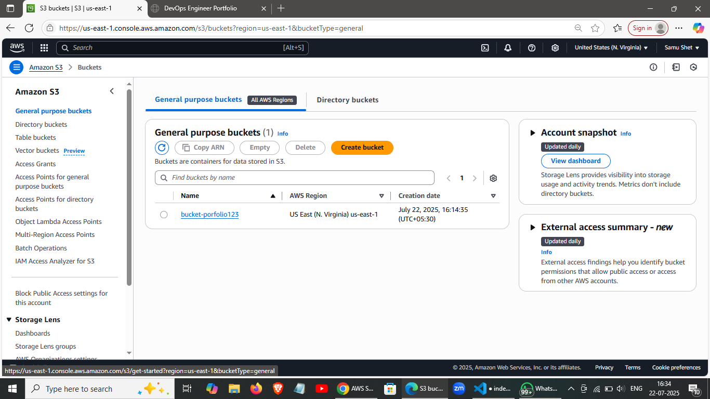

## 1.Create an S3 bucket:

+ Go to S3 → Create bucket
+ Bucket name: your-unique-portfolio-name
+ Uncheck✅ “Block all public access”
+ Click Create bucket.

## 2.Upload the  object like image/pdf/ppt

then upoad the index.html file
[Open index.html](./index.html)

## 3.Go to S3 → Your Bucket → Properties

+ Scroll to Static Website Hosting
+ Enable it, and set:
+ Index document: index.html
(Optional) Error document: error.html
.png)
  + Save
.png)

## 4 then going to the object ownership permission

+ enable ACL
+ Object ownership
+ then Save it
.png)

## 5.then going to the object of our input index.html file 
+ then go to the ACL and check the right permissionon everyone public accesss and check "I undestand"
+ saved it
.png)

## 6.RUN the url endpoint
.png)

✅ You're Done!
